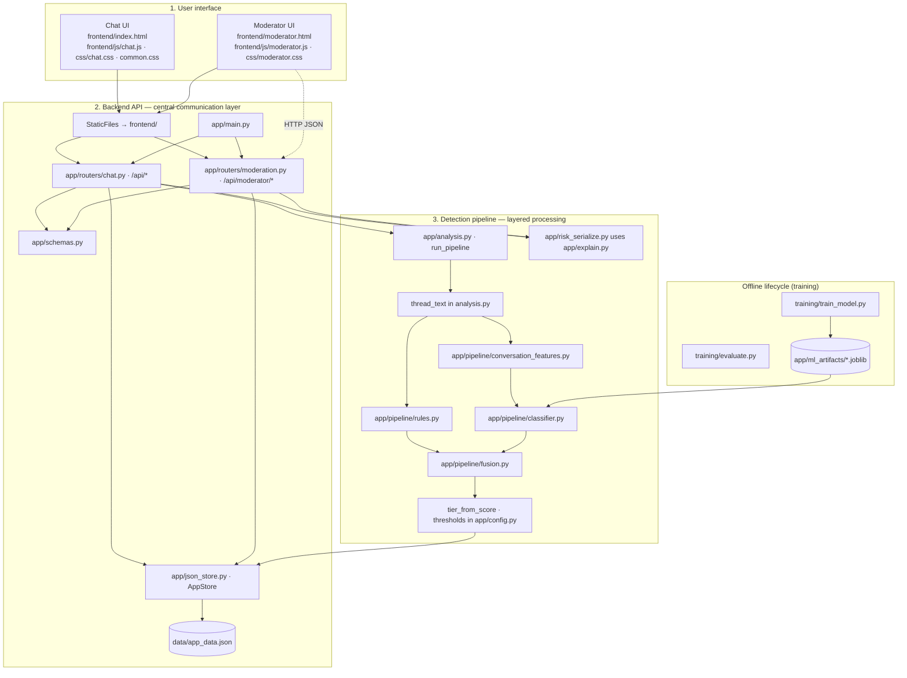
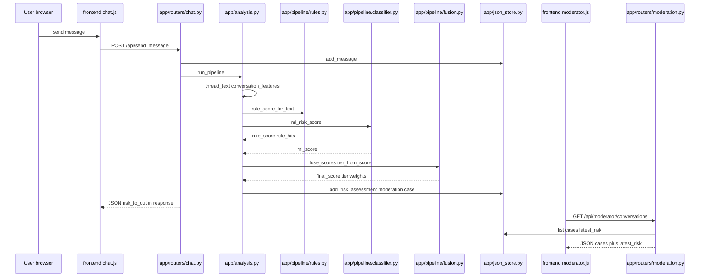
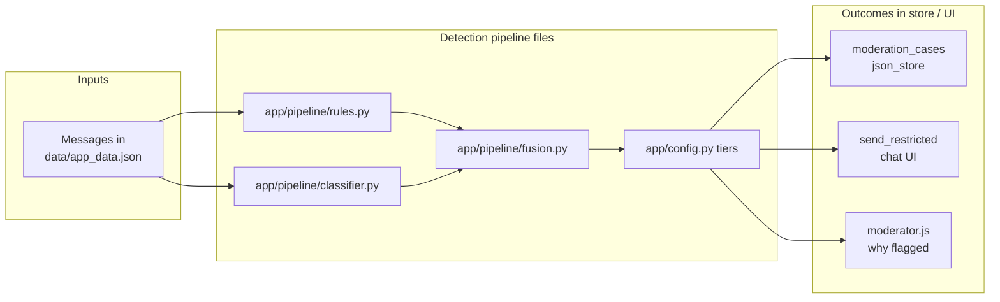

# System architecture

The proposed system is a **modular, conversation-based safety framework** that integrates user interaction, data processing, and automated risk detection in one coherent stack. It supports **real-time-style chat** (via the browser calling the API on each action) and **continuous reassessment** of conversations whenever messages change or a moderator re-triggers analysis.

At a high level there are **three primary components**, matching the design narrative:

1. **User interface** — chat environment and moderator dashboard.  
2. **Backend API** — central layer for requests, persistence, and orchestration.  
3. **Detection pipeline** — layered processing: conversational signals → **rule-based** + **machine learning** analysis → **fusion** → tiered risk → moderation workflow and **human-readable explanations**.

This mirrors a **complex system**: several subsystems interact (UI, API, rules, model, storage), and outcomes (scores, tiers, queue entries, restrictions) **emerge** from those interactions rather than from any single module alone.

Implementation note: the repository ships as a **modular monolith** (one FastAPI application + static front end + JSON persistence), which keeps the same logical separation while remaining straightforward to deploy for coursework or demos.

---

## Source files used (quick reference)

Use this table when labelling your own diagram or appendix. Paths are relative to the **project root** `CIS_Complex_Systems/`.

### User interface (`frontend/`)

| File | Role |
|------|------|
| `frontend/index.html` | Chat page shell, links styles/scripts |
| `frontend/moderator.html` | Moderator queue page shell |
| `frontend/js/chat.js` | Chat list, thread, send message, hybrid risk panel, flagged lines |
| `frontend/js/moderator.js` | Case table, workflow, “Why it was flagged”, start-review, dismiss/confirm |
| `frontend/js/utils.js` | `el()`, `escapeHtml()` |
| `frontend/css/common.css` | Shared theme, header, privacy strip |
| `frontend/css/chat.css` | Chat layout, thread, hybrid panel, risk banner |
| `frontend/css/moderator.css` | Moderator table, workflow badges, flag explanation block |

### Application entry & HTTP API (`app/`)

| File | Role |
|------|------|
| `app/main.py` | FastAPI app, CORS, mounts `chat` + `moderation` routers, serves `frontend/` as static files |
| `app/routers/chat.py` | `/api/bootstrap`, conversations, `send_message`, `analyze`, `flag`; uses `analysis`, `json_store`, `schemas`, `risk_serialize` |
| `app/routers/moderation.py` | `/api/moderator/conversations`, case actions, `start-review`; builds moderator payloads with `risk_serialize` |
| `app/schemas.py` | Pydantic models: `MessageOut`, `RiskOut`, `ConversationOut`, `ModeratorCaseOut`, etc. |
| `app/json_store.py` | `AppStore`: users, conversations, messages, risk assessments, moderation cases; reads/writes JSON |
| `app/config.py` | `Settings`: `artifacts_dir` (default `app/ml_artifacts/`), tier cuts, default ML/rule weights |
| `app/risk_serialize.py` | `risk_to_out()`: maps stored assessment → `RiskOut` (scores, weights, summaries, markers) |
| `app/explain.py` | `ml_confidence_band()`, `rule_trigger_summary()` for human-readable labels |

### Detection pipeline (`app/` + `app/pipeline/`)

| File | Role |
|------|------|
| `app/analysis.py` | `run_pipeline()`: builds thread text, calls rules + ML + `fuse_scores`, persists via `json_store`, moderation upsert |
| `app/pipeline/rules.py` | Rule score, `rule_hits`, clusters, grooming sequence, `per_message_line_markers` |
| `app/pipeline/classifier.py` | Loads joblib pipeline from `app/ml_artifacts/` (see `config.py`), `ml_risk_score()` |
| `app/pipeline/conversation_features.py` | Text augmentation / features fed into the ML path |
| `app/pipeline/fusion.py` | `fuse_scores()`, `tier_from_score()` (uses `app/config.py` thresholds) |

### Persistence & generated data

| File / path | Role |
|-------------|------|
| `data/app_data.json` | Default store for all entities (override with env / `Settings.data_json_path`) |
| `app/ml_artifacts/` | Trained artifacts: e.g. `calibrated_pipeline.joblib` or `vectorizer.joblib` + `model.joblib` (created by training, loaded by `classifier.py`) |

### Offline training & data prep (`training/`, `data/`)

| File | Role |
|------|------|
| `training/train_model.py` | Train sklearn pipeline, write artifacts under `app/ml_artifacts/` |
| `training/evaluate.py` | Validation metrics, optional threshold tuning, fusion comparison |
| `training/datasets.py` | Training data loading / balancing helpers |
| `training/pan12_dataset.py` | Optional external dataset hook (if used in your workflow) |
| `data/generate_synthetic_conversations.py` | Script to generate synthetic conversation data (optional) |

### Dependencies & run

| File | Role |
|------|------|
| `requirements.txt` | Python packages (FastAPI, sklearn, etc.) |
| Run server | e.g. `uvicorn app.main:app` from project root (serves API + static `frontend/`) |

---

## System architecture diagram (three components)

The diagram below maps the **proposed architecture** to **the files above**.

**Reading the diagram**

- **Separation of concerns:** the UI talks only to the API; presentation is not embedded in the detection logic.  
- **Pipeline layering:** the conversation is assembled into a **thread representation** and **feature-oriented text**, then analysed by **rules** and **ML** in parallel, **fused**, and **thresholded** into discrete risk categories.  
- **Moderation & explainability:** suspicious/high outcomes can create or update **moderation cases**; stored assessments are turned into API responses via **`app/risk_serialize.py`** (which uses **`app/explain.py`**). The moderator view adds plain-English copy in **`frontend/js/moderator.js`**.  
- **Training** is **outside** the live request path: **`training/train_model.py`** writes **`app/ml_artifacts/*.joblib`**, which **`app/pipeline/classifier.py`** loads at runtime. **`training/evaluate.py`** can refresh tier thresholds in **`app/config.py`** when you run it with write enabled.

---

## End-to-end flow (conversation update → risk → moderator)

When a conversation is updated (e.g. new message) or re-analysed, the following sequence reflects the **unified** flow through API, storage, and pipeline.

---

## Fusion and emergent outcomes (conceptual)

The **final risk score** is neither “only rules” nor “only ML”: it is an **emergent** result of **fusion** and **policy thresholds**, which then drives **queueing**, **UX warnings**, and **explainable moderator copy**.

---

## Architectural notes (implementation vs. production scaling)

| Topic | This repository |
|--------|------------------|
| **Logical architecture** | Three layers: **UI**, **API**, **detection pipeline** (as above). |
| **Deployment** | **Modular monolith**: one process serves API + static UI. |
| **Persistence** | JSON file via `AppStore` (appropriate for local / demo). |
| **Scaling story** | The same logical blocks could be split across services or cloud components later; the diagram describes the **framework**, not mandatory microservices. |

**Viewing diagrams:** GitHub, VS Code (Mermaid preview), or [mermaid.live](https://mermaid.live).
